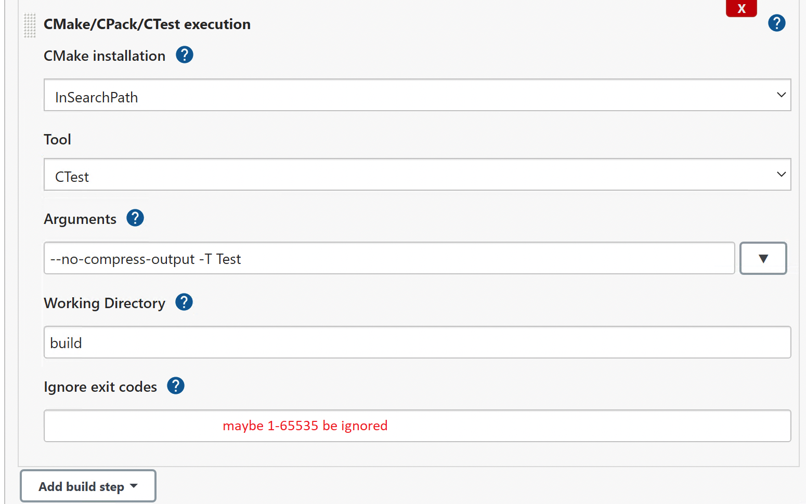

A Git/Fortran/CMake/Jenkins example 

using Fortran, CMake to generate a project

# CMake
CMake generates a lot of files, so it is recommended that you build the program in a separate directory. 
On Linux and Unix, CMake defaults to creating a traditional __Makefile__, 
but CMake can also produce Ninja files to speed-up compilation (but see note below).
```
$ mkdir build
$ cd build
build $ cmake ..
build $ make
```

To take advantage of the Ninja build system, you must install Kitware’s Ninja branch 
which contains enhancements needed to compile Fortran programs. The -GNinja flag instructs CMake to generate Ninja files:
```
build $ cmake -GNinja ..
build $ ninja
```
You can use -D flags to override internal variables. For example:
```
build $ cmake -GNinja -DCMAKE_BUILD_TYPE=Debug -DCMAKE_Fortran_COMPILER=ifort -DCMAKE_INSTALL_PREFIX=/usr/local ..
build $ ninja
```

# Git

## Create a new repository on the command line
```
## change branch name
#$ git branch -m main 
# add remote repository
$ git remote add origin git@github.com:markchron/jenkins-cmake.git
#
$ git push -u origin master
```

## Push an existing repository from the command line
```
# link repository 
$ git remote add origin git@github.com:markchron/jenkins-cmake.git
#$ git branch -m main
# Push code into repository
$ git push -u origin master
```
# Jenkins

## Jenkins + CMake plugin
* Install plugin: Dashboard -> Manage Jenkins -> Under 'SYstem Configuration' -> Manage Plugins -> From the aviable plugins, search 
'CMake'| 'xUnit' . Select them, and 'Install without restart'.


* Create a 'New Item' that has name 'cmake-demo'  with 'FreeStyle'
* Source code management:
Git https://github.com/markchron/jenkins-cmake.git
Credentials: 

* Under _Build_ section, and select 'Add build step' -> CMake Build
Fill out the build options
CMake installation : InSearchPath  #"Jenkins finds CMake. Make sure PATH variable links to it."
Build Directory: build
Script Generator: Visual Studio 15 2017 Win64   #Compiler on agent
Build Type: Release

It's a good idea to set the `Clean Build` flag to make the job always start with a clean state. 

* Check 'Console output' for any issue

> Error: Cannot run program "cmake" ... CreateProcess error=2, The system cannot find the file specified

Add a download-on-demand installation on the global jenkins tool configuration page and
specify that in your job. Or make sure cmake is in $PATH on the node.

> Error: generator: Visual Studo 15 2017 Win64 
> Does not match the generator used previously

Clear the folder `C:\Users\Mark\AppData\Local\Jenkins\.jenkins\workspace\cmake-demo\build`

> Manually-specified variables were not used by the project: CMAKE_BUILD_TYPE

* Hit "Add build tool invocation"
check "Use cmake" to let cmake handle the invocation of your build tool (e.g. make). 
You also specify the target here, which is typically "install" or "package" via the "–target" switch.


* Add another step that runs the tests via CTest. 
Add another Build Step, this time "CMake/CPack/CTest Execution" and pick CTest.

Working Directory: build 
Otherwise, ctest runs under $JENKINS_HOME$/workspace/cmake-demo, then will get `No test configuration file found!`. 
if using windowns, Arguments: --no-compress-output -T Test || verify > NUL
if using Unix, Arguments: --no-compress-output -T Test || /usr/bin/true

Running `ctest` with the option `-T Test` will make CTest generate an XML output file in a sub-folder `Testing` inside the `build` folder, which can be picked up by the `xUnit` plug-in in a post-build action then. 

The one quirk with this is that it will let the build fail 
when CTest returns a non-zero exit code - which it does when any tests fail. 
Usually, you want the build to become unstable and not failed if that happens. 
Hence set "1-65535" in the "Ignore exit codes" input.


Finally the `xUnit` plugin must be configured as:
Add a `Publish xUnit test result report` post-build action and then use the plugin's `Add` button to create a `CTest-Version` test result report. In the `CTest-Version (default) Pattern` enter the file pattern `build/Testing/**/Test.xml`. 


# Troubleshoot
> git@github.com: Permission denied (publickey).

Check if our key is being used to make an SSH connection, by cmd 
`eval "$(ssh-agent -s)" ssh-add -l -E md5`
The first output shows the SSH agent PID on your computer. 
Then lists all the SSH keys that are configured on your machine. 

Check to see if they match the one you've uploaded to GitHub. 

Generate an SSH key `ssh-keygen -t rsa -b 4096 -C "email@email.com" ssh-add -K ~/.ssh/id_rsa`

